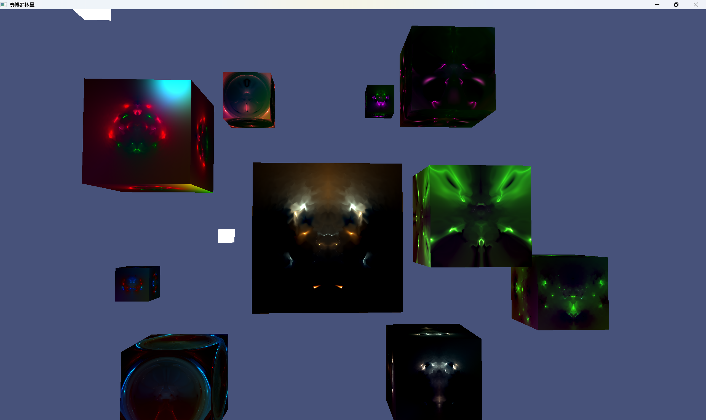
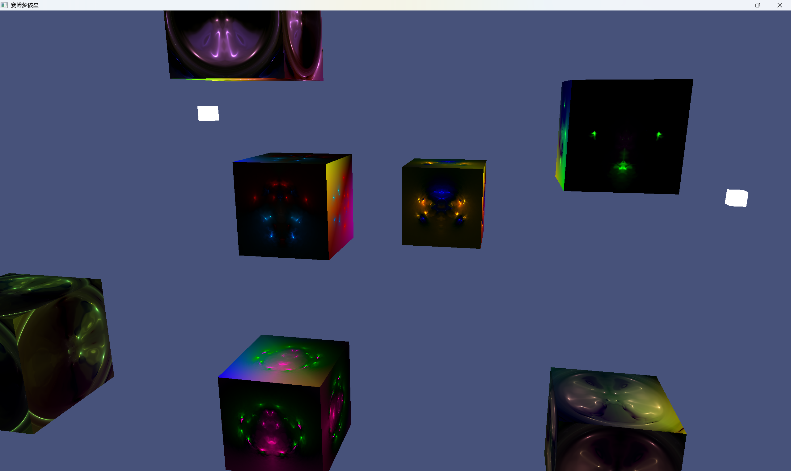

# OpenGL-demo
a demo for opengl learning

## Latest
### [纳米梦核星_哔哩哔哩_bilibili by AXeonV](https://www.bilibili.com/video/BV1S9bjzHE8W)

## Steps
0. Re
1. Shaders

2. Textures

3. Transformations
4. Coordinate Systems

5. Camera

6. Lighting

